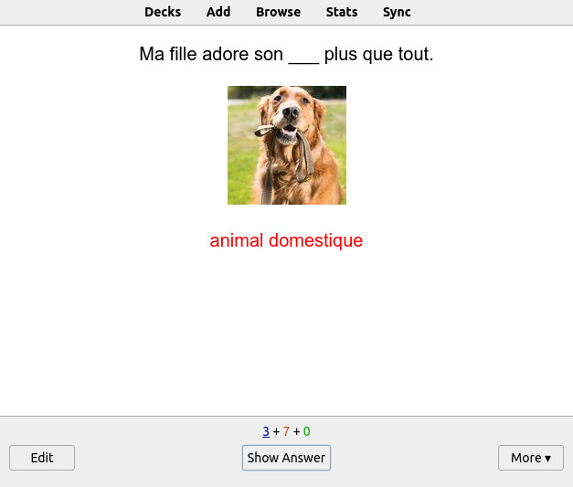
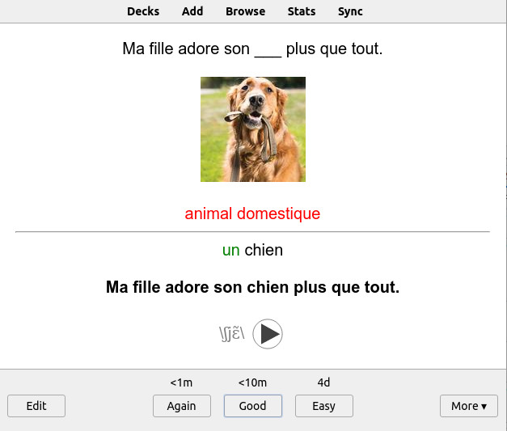
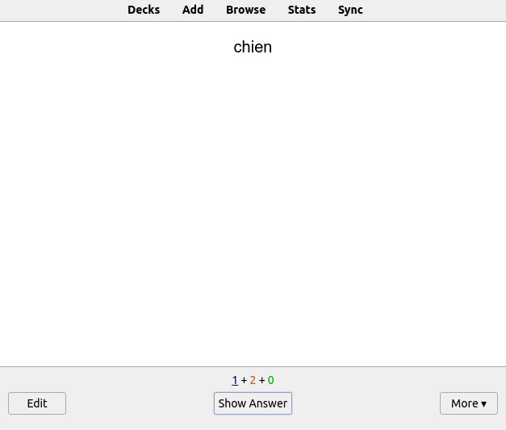
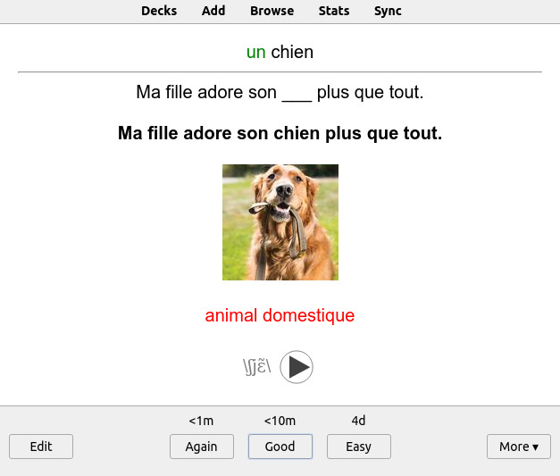
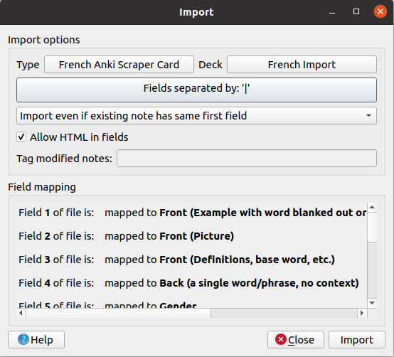

# FrenchAnki

## Introduction
This is a programme desgined for French learners who want to use [Anki](https://apps.ankiweb.net/) to create flashcards. Creating flashcards from scratch can be very time consuming – this programme will help you speed up that process considerably.

FrenchAnkiScraper creates Anki cards inspired by Gabriel Wyner's method, laid out in his book [*Fluent Forever*](https://fluent-forever.com/book/). The idea is to only learn new words using the target language (i.e. French), without resorting to English translations. Moreover, all words should ideally be used in their proper contexts, which is why FrenchAnkiScraper includes example sentences for all cards. For more information, check out [*Fluent Forever*](https://fluent-forever.com/book/).


## What does it do?
FrenchAnkiScraper lets you search for a word in French. It gives you a list of definitions of the word you search for with corresponding example sentences (retrieved from Wordreference.com), information on gender and IPA pronunciation from French Wiktionary, an image from duckduckgo search, as well as a recording of the word from forvo.com, producing a highly detailed and very useful Anki card in less than 30 seconds.

## What kind of Anki card does this programme produce?
FrenchAnkiScraper creates cards with 13 fields. These are:
- Sentence (with word blanked out).
- Picture
- Definition (in French),
- Back (a single word or phrase),
- Gender,
- Full sentence,
- Extra info (pronunciation, etc.),
- Make two cards,
- Test Spelling,
- Test Pronunciation,
- Test Gender,
- English definition,
- Copy and Paste Area

## What does the card look like?
The basic card produced by FrenchAnkiScraper is a fill-in-the-blank example sentence, with a picture and a definition in French, as you can see below. The backside will give the gender and pronunciation (with IPA and sound) as well.





If the tab "make two cards" is selected, there will also be a card the other way around. I.e. you are given the word without context, and your goal is to remember what is means.




The "test spelling", "test pronunciation", and "test gender" tabs are left empty by default. If you write anything in these tabs, separate cards to test spelling, pronunciation and gender will be created. This can be useful if you struggle to remember any of these in particular.

## Getting started

Install all requirements with

```bash
pip install -r requirements.txt
```

You need a working installation of Anki installed. Download here: https://apps.ankiweb.net/

In order to download Forvo sound files, you will need to buy a Forvo API key at https://api.forvo.com/ ($2 a month). Save the API key in a file named api.txt in the FrenchAnki main folder.

To import cards correctly, you have to import the example card file (example_card.apkg) to Anki. This will add the required card template (French Anki Scraper Card)

## Importing to Anki
The Anki cards you create are stored in a file called ankideck.txt.

This file can be imported into Anki with File->Import.

Fields should be separated by the | sign.

Check "Allow HTML tags in fields"

Make sure that "Type" is set to "French Anki Scraper Card".



Finally, move all the image files (in the images folder) and the audio files (in the audio folder) to the subdirectory in your Anki folder called collection.media.

Then, revise your cards! Happy learning!

(Tested on Pop!_OS 22.04)
